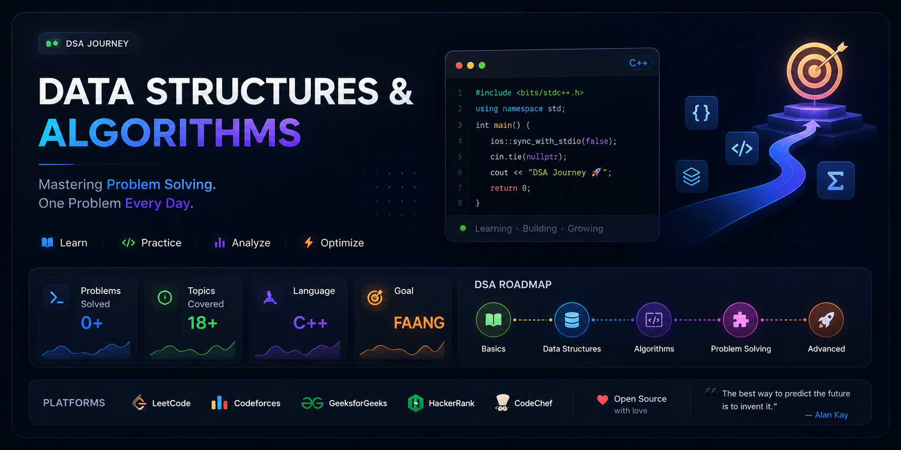

<h1 align="center">🚀 Data Structures & Algorithms Journey</h1>

 

  
  
  
  
  
  

---

# 🚀 About This Repository

> **This repository is a structured documentation of my complete Data Structures & Algorithms journey.**
>
> It contains carefully organized implementations, optimized solutions, interview patterns, detailed explanations, notes, and problem-solving approaches from beginner to advanced level.

---

# 🎯 Mission

<table>
<tr>
<td align="center" width="25%">

### 📚

### Learn

Master every core DSA topic.

</td>

<td align="center" width="25%">

### 💻

### Practice

Solve problems consistently.

</td>

<td align="center" width="25%">

### 🧠

### Improve

Develop strong analytical thinking.

</td>

<td align="center" width="25%">

### 🏆

### Achieve

Crack top product-based companies.

</td>

</tr>
</table>

---

## 💎 Repository Highlights

| 🚀 Feature | ✅ Included |
|:-----------|:-----------:|
| Clean C++ Solutions | ✔ |
| Brute → Better → Optimal | ✔ |
| Time Complexity | ✔ |
| Space Complexity | ✔ |
| Interview Notes | ✔ |
| Topic-wise Organization | ✔ |
| Visual Explanations | ✔ |
| Daily Progress | ✔ |
| Pattern Based Learning | ✔ |
| Company Questions | ✔ |

---

## 🌟 Quote of the Journey

---

### ⭐ If you find this repository useful,

### Consider giving it a ⭐ to support the journey.

---
 

# 📊 Developer Dashboard

  

| 🚀 Problems | 📚 Topics | 💻 Language | 🎯 Goal | 🔥 Status |
|:----------:|:---------:|:----------:|:-------:|:--------:|
| **0+** | **18+** | **C++** | **FAANG** | **Learning** |

---

# 🌟 About This Repository

### 🚀 A structured journey to master **Data Structures & Algorithms**

> This repository is my personal roadmap to becoming a better problem solver and software engineer. Every solution is organized topic-wise with explanations, complexity analysis, and clean C++ implementations.

 

### 🎯 Repository Goals

| Goal | Progress |
|:----|:--------:|
| 📚 Learn Core DSA | 🟢 |
| 💻 Solve 500+ Problems | 🟡 |
| 🧠 Master Problem Solving | 🟢 |
| 🏆 Crack Product Companies | 🔥 |
| 🌱 Learn Every Day | ❤️ |

---
 

<h1 align="center">🗺️ DSA Learning Roadmap</h1>

<i>A structured roadmap from programming fundamentals to advanced algorithms.</i>

 

| Stage | Topic | Difficulty | Status |
|:----:|:-------------------------|:---------:|:------:|
| 🌱 | Programming Fundamentals | 🟢 Easy | ⏳ |
| 📦 | Arrays | 🟢 Easy | ⏳ |
| 🔤 | Strings | 🟢 Easy | ⏳ |
| 🔁 | Recursion | 🟡 Medium | ⏳ |
| 🔗 | Linked List | 🟡 Medium | ⏳ |
| 📚 | Stack | 🟡 Medium | ⏳ |
| 📥 | Queue | 🟡 Medium | ⏳ |
| #️⃣ | Hashing | 🟡 Medium | ⏳ |
| 🌳 | Trees | 🟠 Medium | ⏳ |
| 🌲 | Binary Search Tree | 🟠 Medium | ⏳ |
| ⛰️ | Heap / Priority Queue | 🟠 Medium | ⏳ |
| 🕸️ | Graph | 🔴 Hard | ⏳ |
| 💰 | Greedy | 🟠 Medium | ⏳ |
| 🧠 | Dynamic Programming | 🔴 Hard | ⏳ |
| 🎯 | Backtracking | 🔴 Hard | ⏳ |
| ⚡ | Bit Manipulation | 🟠 Medium | ⏳ |
| 🌐 | Trie | 🔴 Hard | ⏳ |
| 🚀 | Advanced Algorithms | 🔥 Expert | ⏳ |

---

<h2 align="center">🎯 Progress Overview</h2>

| Category | Progress |
|:----------|:--------:|
| 🌱 Basics | ░░░░░░░░░░ 0% |
| 📦 Arrays | ░░░░░░░░░░ 0% |
| 🔤 Strings | ░░░░░░░░░░ 0% |
| 🌳 Trees | ░░░░░░░░░░ 0% |
| 🕸️ Graph | ░░░░░░░░░░ 0% |
| 🧠 DP | ░░░░░░░░░░ 0% |
| 🚀 Overall | ░░░░░░░░░░ 0% |

---

<h2 align="center">🏆 Learning Strategy</h2>

| 📌 Focus | 💡 Description |
|:---------|:--------------|
| 📖 Learn Theory | Understand concepts before coding |
| 💻 Implement | Write solutions from scratch |
| 🔄 Revise | Weekly revision of completed topics |
| ⚡ Optimize | Improve brute-force solutions |
| 🧩 Pattern Recognition | Solve similar problem types |
| 🏆 Interview Ready | Practice company-specific questions |

---

